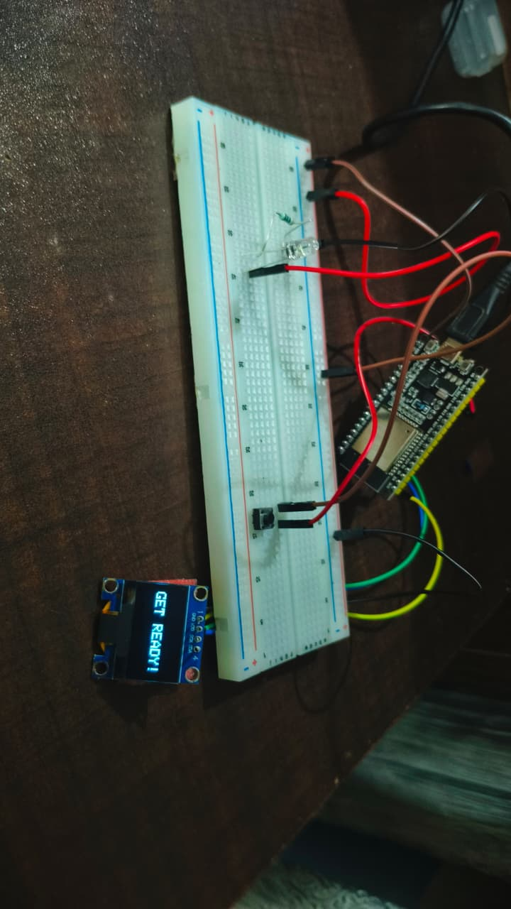
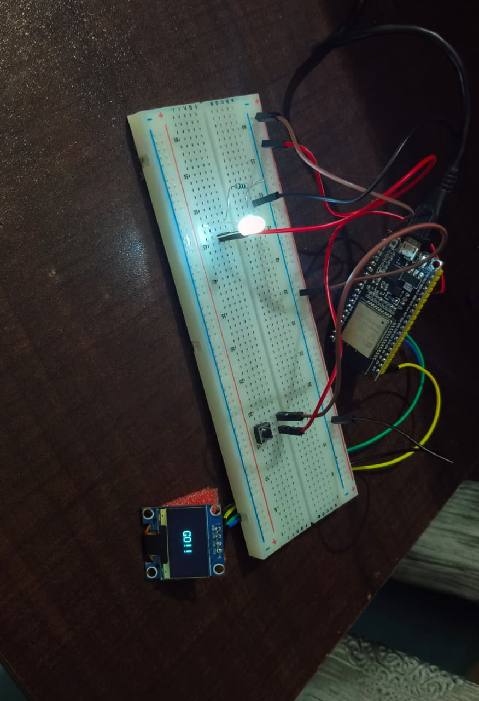
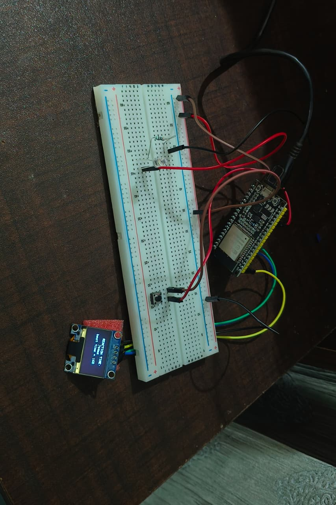

# ESP32 Reaction Time Game

An ESP32-based reaction time game built as my first embedded systems project.

The player waits for the LED to turn on and then presses a button as quickly as possible. The ESP32 measures the reaction time and displays the result and best score on an SSD1306 OLED.

## Features

- Random delay before the LED turns on
- Reaction time measurement using `millis()`
- Button debouncing
- Button press detection
- Enum-based state machine
- State transition detection
- SSD1306 OLED display using I2C
- Best reaction time tracking
- Automatic new rounds
- Non-blocking timing

## Hardware

- ESP32
- 0.96" SSD1306 OLED
- LED
- 220Ω resistor
- Push button
- Breadboard
- Jumper wires

## Pin Connections

| Component | ESP32 |
|---|---|
| LED | GPIO 4 |
| Button | GPIO 13 |
| OLED SDA | GPIO 21 |
| OLED SCL | GPIO 22 |

## How It Works

1. The OLED displays `GET READY!`.
2. The ESP32 waits for a random amount of time.
3. The LED turns on and the OLED displays `GO!!`.
4. The player presses the button.
5. The ESP32 calculates the reaction time.
6. The reaction time and best score are displayed.
7. After 5 seconds, a new round begins.

## Embedded Concepts Used

### GPIO
Used GPIO pins to control the LED and read the push button.

### Button Debouncing
Software debouncing prevents mechanical button bouncing from being interpreted as multiple presses.

### Non-blocking Timing
`millis()` is used instead of `delay()` for timing the game.

### State Machine
The game is divided into four states:

- `w8fLedOn`
- `w8fButtonPress`
- `result`
- `waitForNextRound`

### I2C Communication
The ESP32 communicates with the SSD1306 OLED using I2C.

### State Transition Detection
The program detects when the game changes from one state to another and performs OLED updates only when necessary.

## Screenshots

### Get Ready

### Go

### Result

## Future Improvements

- False-start detection
- Persistent high-score storage
- Round counter
- Better random-number seeding
- Improved OLED interface
